# Architecture

This document covers the technical architecture of LangReels AI: the service map, data flow, Firestore schema, and Cloud Functions in detail. For a plain-language walkthrough of the same pipeline, see [How it works](../HOW_IT_WORKS.md).

---

## Service map

| Service                         | Role                                                      | Notes                                                                                    |
| ------------------------------- | --------------------------------------------------------- | ---------------------------------------------------------------------------------------- |
| Firebase Storage                | Stores uploaded videos                                    | `videos/reels/{userId}/reel_{uuid}.mp4`                                                  |
| Firebase Firestore              | Reel metadata, processing status, translations, user data | Real-time stream listener drives UI                                                      |
| Firebase Auth                   | User accounts                                             | Email/password + Google Sign-In                                                          |
| Firebase Cloud Functions        | Pipeline orchestration                                    | Node.js 20, serverless                                                                   |
| AWS S3                          | Temporary video storage during transcription              | Deleted after webhook completes                                                          |
| AWS Transcribe                  | Speech-to-text, language detection, SRT output            | Core transcription engine                                                                |
| AWS EventBridge + SNS           | Job-complete callback to Firebase                         | EventBridge rule captures Transcribe events → routes to SNS topic → HTTP POST to webhook |
| Google Cloud Video Intelligence | Content moderation                                        | Runs in parallel with transcription                                                      |
| Google Cloud Translation API v3 | Batch sentence translation                                | 14 calls per video (one per non-source language)                                         |

---

## Pipeline diagram



---

## Cloud Functions

Five functions are deployed. Two trigger automatically; three are callable or HTTP.

### `moderateContent`

- **Trigger:** `onObjectFinalized` — fires when any `.mp4` lands at `videos/reels/`
- **Runtime:** 1 CPU, 1GiB, 300s timeout
- **What it does:**
  - Calls Google Video Intelligence with `EXPLICIT_CONTENT_DETECTION` and `LABEL_DETECTION`
  - Fails any frame rated above `POSSIBLE` for explicit content
  - Fails any segment-level label matching a keyword list (`violence`, `weapon`, `drug`, etc.) at ≥70% confidence
  - Updates `reels/{reelId}.processingStatus` to `rejected` or `moderationCompleted`
- **Runs in parallel with `transcribeAndTranslate`**

### `transcribeAndTranslate`

- **Trigger:** `onObjectFinalized` — same Storage event as `moderateContent`
- **Runtime:** 1 CPU, 1GiB, 120s timeout
- **What it does:**
  1. Downloads the video from Firebase Storage to `/tmp/`
  2. Uploads the video to AWS S3
  3. Starts an AWS Transcribe job with `IdentifyLanguage: true` and 15 language hints
  4. Stores job metadata (`jobName`, `reelId`, S3 key) in `transcribe_jobs/{jobName}` Firestore collection
  5. Updates reel status to `transcribing`
  6. **Exits immediately** — does not poll AWS
  7. Deletes local `/tmp/` file

### `handleTranscribeWebhook`

- **Trigger:** HTTP POST from AWS EventBridge / SNS
- **Runtime:** 2 CPU, 2GiB, 300s timeout
- **What it does:**
  1. Handles SNS subscription confirmation handshake on first call
  2. Parses the SNS notification to extract job name and status
  3. Looks up job metadata from `transcribe_jobs` Firestore collection
  4. If job failed: updates reel status to `failed`, cleans up S3 files, deletes job document
  5. If job succeeded:
     - Fetches transcript JSON from S3 → extracts `words[]` with timing
     - Fetches SRT file from S3 → parses into `sentences[]` with timing
     - Runs language validation (Google Translate detect as fallback if AWS language code not in supported list)
     - Calls `batchTranslateSentences()` — 14 batch API calls, one per non-source language
     - Writes results to `translations/{reelId}` and updates `reels/{reelId}`
     - Cleans up: deletes S3 video + transcript files, deletes AWS Transcribe job, deletes `transcribe_jobs` document

### `reprocessReel`

- **Trigger:** Callable function
- **What it does:** Resets a reel's processing status to `pending`, deletes existing `translations/{reelId}` document, deletes any stale `transcribe_jobs` entries. Used for manual reprocessing or cleanup after a failed job.
- **Usage:** `firebase functions:call reprocessReel --data='{"reelId": "your-reel-id"}'`

### `healthCheck`

- **Trigger:** Callable function
- **What it does:** Tests connectivity to Firestore, Firebase Storage, Google Translate, and AWS Transcribe. Returns status object and count of pending transcription jobs.
- **Usage:** `firebase functions:call healthCheck`

---

## Data flow

```
User uploads video
        │
        ▼
Firebase Storage: videos/reels/{userId}/reel_{uuid}.mp4
        │
        ├─────────────────────────────────┐
        ▼                                 ▼
moderateContent                 transcribeAndTranslate
(Google Video Intelligence)     (uploads to S3, starts AWS job, exits)
        │                                 │
        ▼                          AWS Transcribe runs
pass / reject                     (1–3 min, independent)
        │                                 │
        ▼                          AWS EventBridge fires
Firestore: reels/{reelId}              ▼
processingStatus update         handleTranscribeWebhook
                                        │
                                 fetch transcript + SRT from S3
                                        │
                                 parse words[] + sentences[]
                                        │
                                 14× Google Translate batch calls
                                        │
                                 write Firestore:
                                 translations/{reelId}
                                        │
                                 update Firestore:
                                 reels/{reelId}.processingStatus = 'completed'
                                        │
                                 Flutter realtime listener fires
                                 → reel appears in feed
```

---

## Firestore schema

### `reels/{reelId}`

| Field                     | Type      | Description                                                                                       |
| ------------------------- | --------- | ------------------------------------------------------------------------------------------------- |
| `authorId`                | string    | Firebase Auth UID                                                                                 |
| `authorName`              | string    | Username                                                                                          |
| `videoUrl`                | string    | Firebase Storage gs:// or download URL                                                            |
| `processingStatus`        | string    | `uploading` · `moderating` · `transcribing` · `translating` · `completed` · `rejected` · `failed` |
| `isProcessed`             | boolean   | true once pipeline completes                                                                      |
| `passedModeration`        | boolean   | Set by `moderateContent`                                                                          |
| `sourceLanguage`          | string    | ISO 639-1 code detected by AWS Transcribe                                                         |
| `originalText`            | string    | Full transcript text                                                                              |
| `transcriptionConfidence` | number    | Average confidence score (0–1)                                                                    |
| `hasSentenceData`         | boolean   | true if sentence-level data exists                                                                |
| `totalSentences`          | number    | Count of sentences                                                                                |
| `translationsDocPath`     | string    | Path to `translations/{reelId}` document                                                          |
| `languageCount`           | number    | Number of languages available                                                                     |
| `processingVersion`       | string    | Pipeline version tag (e.g. `5.0-event-driven-aws`)                                                |
| `createdAt`               | timestamp | Upload time                                                                                       |
| `lastUpdated`             | timestamp | Last status change                                                                                |

### `translations/{reelId}`

| Field               | Type      | Description               |
| ------------------- | --------- | ------------------------- |
| `sourceLanguage`    | string    | Detected language code    |
| `originalText`      | string    | Full transcript           |
| `sentences`         | array     | See sentence schema below |
| `words`             | array     | See word schema below     |
| `processedAt`       | timestamp |                           |
| `translationMethod` | string    | `batch` (current)         |
| `processingVersion` | string    |                           |

**Sentence object:**

```json
{
  "index": 0,
  "originalText": "Where is the train station?",
  "startTime": 0.0,
  "endTime": 3.5,
  "confidence": 0.95,
  "translations": {
    "en": "Where is the train station?",
    "es": "¿Dónde está la estación de tren?",
    "fr": "Où est la gare?",
    "de": "Wo ist der Bahnhof?",
    "... (15 languages total)": "..."
  }
}
```

**Word object:**

```json
{
  "word": "station",
  "startTime": 2.84,
  "endTime": 3.21,
  "confidence": 0.97
}
```

### `transcribe_jobs/{jobName}`

Ephemeral — created by `transcribeAndTranslate`, deleted by `handleTranscribeWebhook`.

| Field           | Type      | Description                |
| --------------- | --------- | -------------------------- |
| `reelId`        | string    | Firestore reel document ID |
| `jobName`       | string    | AWS Transcribe job name    |
| `videoFileName` | string    | S3 object key              |
| `bucketName`    | string    | S3 bucket name             |
| `status`        | string    | `IN_PROGRESS`              |
| `startedAt`     | timestamp |                            |

### `users/{userId}`

Standard profile document: `username`, `email`, `displayName`, `bio`, `reelsCount`, `followersCount`, `savedReels[]`, `languagePreferences` (primary language, learning languages, proficiency levels).

---

## Processing versions

Reel documents carry a `processingVersion` field for debugging and future migrations:

| Version                 | Description                                              | Status      |
| ----------------------- | -------------------------------------------------------- | ----------- |
| `v4.0-openai-dual`      | OpenAI Whisper transcription + mapping-based translation | Deprecated  |
| `v4.1-batch`            | OpenAI Whisper + Google Translate batch                  | Deprecated  |
| `v5.0-event-driven-aws` | AWS Transcribe (event-driven) + Google Translate batch   | **Current** |

---

## Legacy files

Two files exist in `functions/` but are not imported by `index.js` and have no effect on the running pipeline. They are safe to delete:

- `functions/sentence-processor.js` — sentence alignment logic from v4.0, when OpenAI Whisper was used
- `functions/translation-mapper.js` — full-text translation splitting logic, replaced by batch approach in v4.1

---

## Processing status progression

```
uploading → moderating → transcribing → translating → completed
                │
                └─ rejected (content moderation failed)

any stage → failed (unhandled error)
```

The Flutter app maps each status to a progress value (0.0–1.0) and estimated time remaining for the processing indicator shown to creators.

---

## Cost per video (approximate)

| Service                   | Usage per 2-min video     | Approx. cost    |
| ------------------------- | ------------------------- | --------------- |
| AWS Transcribe            | 2 min audio               | ~$0.048         |
| AWS S3                    | Temp storage + requests   | < $0.001        |
| Google Cloud Translation  | ~500 chars × 14 languages | ~$0.07          |
| Google Video Intelligence | 2 min video               | ~$0.10          |
| Firebase Cloud Functions  | ~3 invocations            | < $0.01         |
| **Total**                 |                           | **~$0.15–0.23** |

Translation cost scales linearly with video length and sentence count. Video Intelligence is the dominant cost at low volumes.

---

<div align="center">

[← Back to README](../README.md) · [How it works](../HOW_IT_WORKS.md) · [Product & strategy](./PRODUCT.md) · [Fork & setup](../FORK_AND_SETUP.md)

</div>
